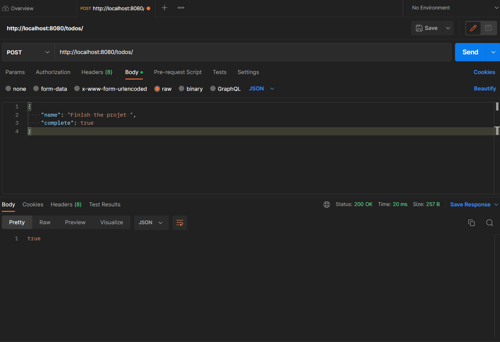
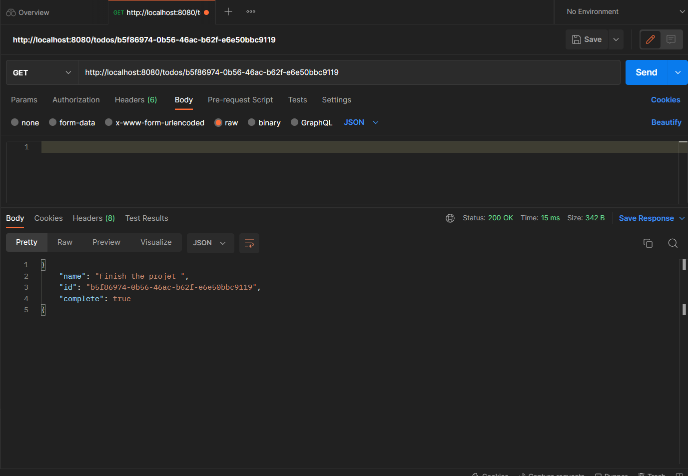
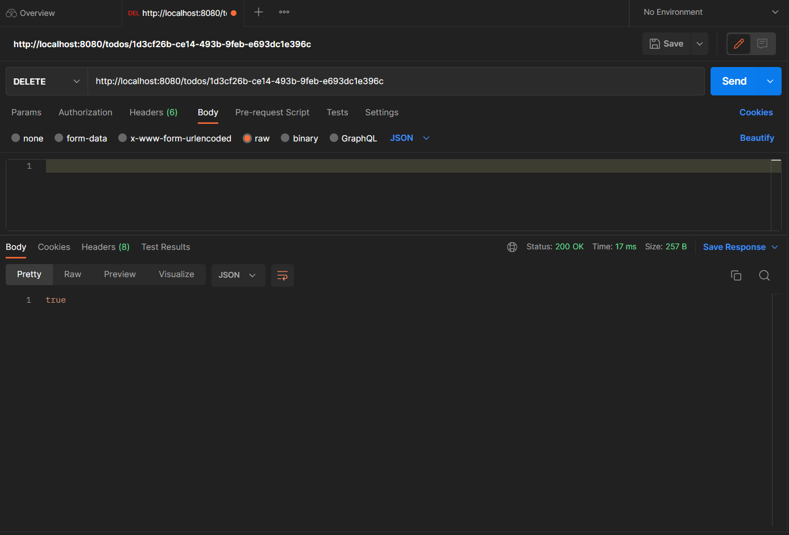

# ToDo_API

The POST method thats add a new ToDo list into the API server

The GET method thats finds a ToDo list into the API server

The DELETE method thats delete a ToDo list from the API server

